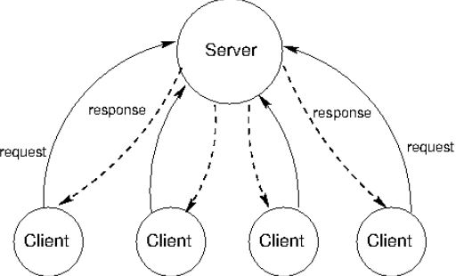
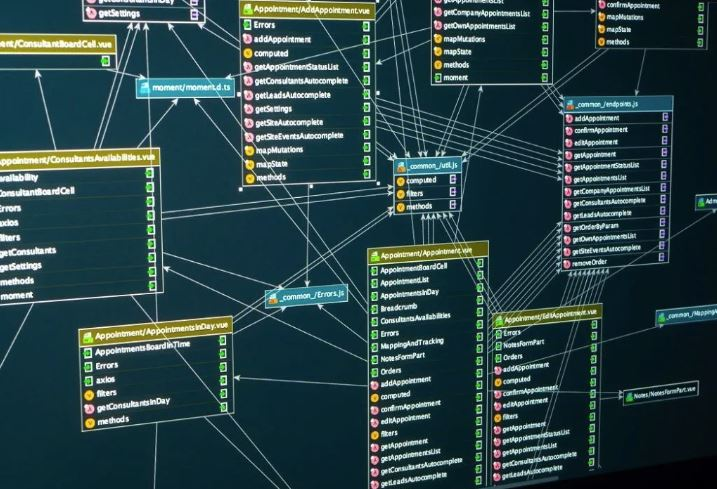

# Professional Self Assessment

## Collaborating in a Team Environment

## Communicating to Stakeholders

## Data Structures and Algorithms

## Software Engineering and Databases

## Security

## Self Assessment

# Code Review
Introduction and Artifact One Review can be found [here](https://youtu.be/MNbDwvWprhM).  
Artifact Two Review can be found [here](https://youtu.be/ed9p4Jq6Fq0).

# Artifact One: Software Design and Engineering

<h4 align="center"></h4>

[Original Project Code](https://github.com/acroteau1/IT-365-Operating-Environments)

[Modified Project Code](https://github.com/acroteau1/Operating-Environments)

## Description

For this artifact, I worked on the “Operating Environments” project. This artifact was created during my time in IT-365: Operating Environments in late 2020. This program simulates the communication between a user’s web browser, the server, and the server response using several different classes and methods. Depending on the class, there are programs responsible for simulating a simple web server, returning header output, and mapping configuration parameters, among other functions.

```python
        try:
        # Use the default (non-validating) parser
            parser = xml.sax.make_parser()

        # Parse the Input
            parser.parse(open(configurationFile, "a"), self)
        # Write in contingency instructions for SAX parse exceptions, SAX exception, and I/O exception
        except:
            parser_config_exception = xml.sax.SAXParseException(
                "Parser Configuration Exception",
                None, self._locator)
            self.getErrorHandler().error(parser_config_exception)
            sax_exception = xml.sax.SAXException(
                "SAX Exception")
            self.getErrorHandler().error(sax_exception)
        # True I/O Exception not supported. Closest SAX exception used instead. 
            IO_exception = xml.sax.SAXNotRecognizedException(
                "SAX not recognized")
            self.getErrorHandler().error(IO_exception)
```

## Justification
This artifact is being included in the ePortfolio because it was a project I felt confident working with. I felt that the changes and additions that I made to the base code presented by my instructor when taking the course were well understood, and I was confident in dissecting the code and how it worked. I also felt it would be an appropriate choice because it showcased my skills and abilities in understanding both the original programming language and the one that it would be translated into. The artifact was improved by translating the project from Java to Python, both of which are object-oriented programming languages that would accommodate the functions of the program efficiently. I specifically dissected each file of the original program one at a time to examine what each file was doing in the overall program. From there, I researched similar classes, functions, and packages in Python and worked on re-writing the code in Python so that it would function the same way.

```python
# Create DateFormatter class. Create a variable for current date and time. Modify
# the rightNow variable into the datetime format created in the original files. Declare
# output string and set it to the SimpleDateFormat variable.
class DateFormatter():
    rightNow = datetime.now()
    SimpleDateFormat = rightNow.strftime("%d-%b-%Y %H:%M:%S")
    output = ""

    output = SimpleDateFormat
    # Print the current date and time in the specified format.
    print(output)
```

I met the course objectives that I planned to meet with this enhancement from my original plan. I specifically targeted course outcome CS-499-04, or the use of skills and techniques to apply valuable solutions and to meet the goals of production. I used my knowledge in both java and python to understand the original program, identify what to implement in the new program, and how to write it so it would function without errors. I also demonstrated understanding of the python language by working out syntax and resource errors when the code was originally compiled. Additionally, I was able to complete this work in under a week, demonstrating an ability to meet production goals and follow timelines and deadlines. As far as my outcome-coverage plans, I originally only included plans to re-work the “Configuration” file, but I was able to re-work every file from the original project instead. This will provide a more complete final artifact and a more rounded program that will function as the original project intended. 

## Reflection
In this project, I was able to utilize the Python language to re-create a program from the ground up. I learned quite a bit while I was creating and improving this project. I extensively researched XML exceptions and how they were implemented in a Python program. I also had to determine how to manipulate the “datetime” function to print the date the same way it was printed in the original program. I also had to research how to extend classes in Python, and then determine the equivalent Python class compared to the original Java class that was extended. I faced several challenges during the course of improving this artifact. I had to research several methods that I was not familiar with or had not extensively used, such as the “super()” method, writing exceptions into the code, and the try and catch methods. While these were utilized in the original project in Java, I had limited to no experience with them in Python. I also struggled with the Attributes object type from Java, which did not have a similar object type in Python, leading me to utilize a dictionary object type in its place. Finally, I also struggled to determine the appropriate packages to import in each file, as the packages in Java did not always have identical packages in Python, requiring some creativity to determine what was needed to make the program run correctly. Overall, it was a great learning experience to translate this project from Java to Python, and enhanced my understanding and comfort with both languages. 

```python
# Create test class. Declare a parser, and instruct it to write to
# the configuration XML file. Instruct program to output an error
# message in the event of an exception.
class test():
    parser = configparser.ConfigParser()
    try: 
        with open(r"./config.xml", 'w') as cf:
            parser.write(cf)
    except Exception as ce:
        print(str(ce))
        exit()
```

# Artifact Two: Algorithms and Data Structures

<h4 align="center"></h4>

[Original Project Code](https://github.com/acroteau1/CS-340)

[Modified Project Code](https://github.com/acroteau1/Search-and-Rescue-Dashboard)

## Description
The artifact for this milestone was the “Rescue Animal Database” project from CS-340: Advanced Programming Concepts. This artifact was created in late 2021. This project incorporated a database of animals and was primarily created for a theoretical company to be able to search through the database more efficiently. Currently, there exist files within a Jupyter Notebook that allow for automated tests to check for the ability to create, read, update, and delete data, as well as the database information. 

```Jupyter Notebook
# Create node class and initialize the node
class Node:
    def __init__(self, data):
        self.item = data
        self.next = None
        self.prev = None
    # Create doubly linked list class
    def __init__(self):
        self.start_node = None
    # Insert Element to Empty list
    def InsertToEmptyList(self, data):
        if self.start_node is None:
            new_node = Node(data)
            self.start_node = new_node
        else:
            print("The linked list is not empty.")
```

## Justification
This item was selected for inclusion within the ePortfolio because it is an item that held a lot of potential for improvement. The original project was relatively basic as far as design, implementation, and work within the database. This left a lot of room to come up with creative solutions to make the project work more fully as it was intended. In particular, this artifact allows me to showcase my skills and abilities in algorithms and data structures through the implementation of a doubly-linked list for search results, and the implementation of the tkinter method for clickable “next” and “previous” buttons. Neither of these methods were implemented in the original project nor were they utilized in any other coursework during my undergraduate studies. This demonstrates an ability to understand and implement data structures that are not familiar to me through independent research and testing. This artifact was improved through the use of the list and clickable buttons by enhancing the user experience. This improvement allows users to scroll through results without needing to return to the entire list of returned results after performing a search or performing a new search after viewing a single result. 

I met the course objectives that I planned to meet with this enhancement in Module One by creating a working code that implemented the changes that were planned earlier on. In particular, I was able to create several classes that encompassed the purpose and execution of a doubly-linked list. I also needed to add a section that would filter results by animal type, and a section to search based on the selected filter. Then, I was able to call those classes at the appropriate part of the code that returned results. Finally, I was able to adjust the code to include the “next” and “previous” buttons, which referenced corresponding nodes in the doubly-linked list classes. As far as the course outcomes, I was able to meet the outcome CS-499-03 which encompasses the creation of solutions for a given problem using principles and practices of algorithms and computer science while managing design choices. Overall, I would say that outcome-coverage plans expanded based on what I had originally planned, as I realized my original files did not have a search function available, and that without that function, I would not be able to implement this data structure. 

## Reflection
During the course of improving this project, I had to learn appropriate ways to create a doubly-linked list. The first challenge I faced was in this lesson, as I realized after writing the original method that I did not have a search function available to implement the data structure within. Then came the next lesson, determining how to implement a simple search function using radio buttons. I was also able to do this successfully, and was able to create a simple search option for either dogs or cats. Next, I had to learn and implement the tkinter method to enable clickable buttons, as well as figure out the dash code that would be required to place the buttons where I wanted them on the results. The end result is a cohesive design that meets the goals of the planned artifact improvement.

# Artifact Three: Databases

<h4 align="center"></h4>

[Original Project Code](https://github.com/acroteau1/CS-340)

[Modified Project Code]

## Description

## Justification

## Reflection
